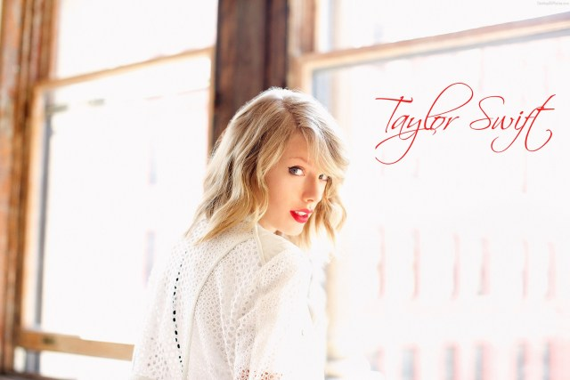

<html>
    <head>
        <meta charset="utf-8">
        <meta http-equiv="X-UA-Compatible" content="IE=edge">
		<meta Stella="viewport" content="width=device-width">
        <title>Taylor Swift</title>
    </head>
    <body>
		<h1>Taylor Swift </h1>
        <article>
            <header>
                <h2>Personal information</h2>
                
                <h4>Taylor Swift, born in Pennsylvania on December 13, 1989, is an American singer, songwriter, music producer and actor.</h4>
                
            </header>
            <section>
                

                
                
 Taylor Swift (born December 13, 1989 in Pennsylvania, USA) is an American singer, songwriter, music producer and actress. In 2006, she released her first music album, Taylor Swift, which was certified by the Recording Industry Association of America and sold five times as platinum. In 2008, she released the music album Fearless, which won the No. 1 on the US Billboard Album Chart for 11 weeks, certified 7 times platinum sales, and won the 52nd Grammy Award for Album of the Year. 
                    
                 
 In 2010, she released the album "Speak Now" and won two Grammy Awards for the single "Mean". In the same year, he was awarded the Hal David Star Award by the Writers Hall of Fame. In 2011, with the sales of three physical albums, it was certified as "five platinum albums" in China. In 2012, she began to transform herself into a pop singer and released her music album 'Red', the physical version of which was certified as' double platinum album 'in China. In 2013, he won the 47th Country Music Association Award (CMA).
 
                    
                 
 In 2014, she released the music album 1989, which won the Album of the Year award at the 58th Grammy Awards, and the International Federation of the Phonographic Industry (IFPI) announced the album as the "annual global album sales champion". In the same year, he won the Dick Clark Lifetime Achievement Award at the American Music Award and was shortlisted as the Person of the Year of the Time magazine (American edition).

                    
                 
  In April 2015, he won the 50th Anniversary Milestone Award at the 50th Academy of Country Music Awards. In 2017, she released her music album Reputation, which sold 1.238,000 copies in its first week in the US, making her the singer who has four albums selling one million copies in its first week. In the same year, he was chosen by Time magazine as Person of the Year. In 2019, the music album "Lover" was released; In the same year, the International Federation of the Phonographic Industry (IFPI) declared the album the "annual global album sales number one". In 2020, the music albums Folklore and Evermore were released.

                
             
                
<a href="journal%20(2).html">Look at next page</a >

            </section>
        </article>
    </body>
</html>
